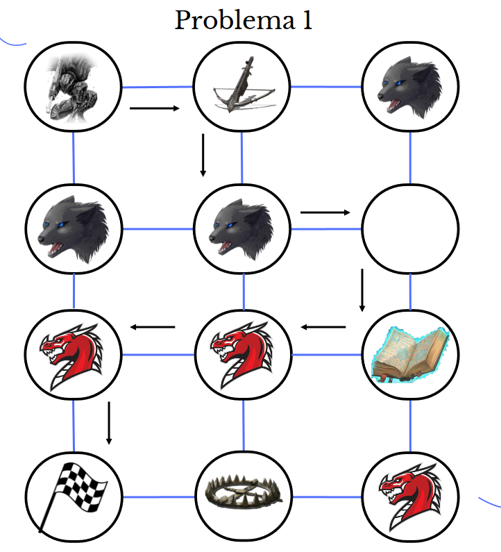
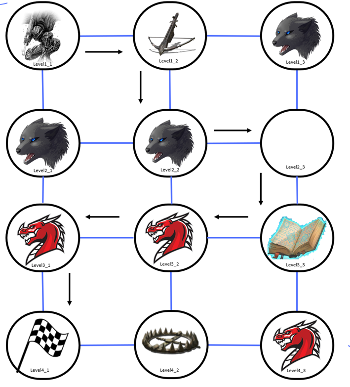
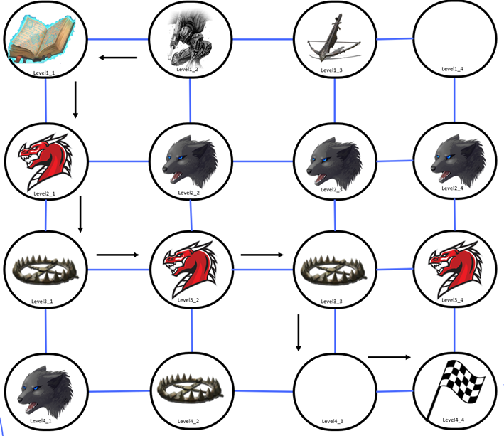

# Planificación automatica aplicada a un juego RPG

## Planificacion automatica
La planificación automática es un campo de la inteligencia artificial que se centra en el desarrollo de algoritmos y técnicas que permiten a un sistema tomar decisiones secuenciales para lograr objetivos predefinidos. Implica la generación automática de planes, secuencias de acciones, que permiten a un agente o sistema avanzar desde un estado inicial a un estado deseado, considerando restricciones y condiciones del entorno. 

## Planificacion automatica aplicada a un dominio de un RPG
El propósito fundamental es la consecución de ir desde el nivel inicial hasta el nivel meta, superando los desafíos presentes en los distintos niveles que conforman un mundo dentro del juego.

### consideraciones para el juego
- El jugador debe ir desde el nivel inicial hasta la meta.
- En cada nivel puede haber una bestia, un dragón, una trampa, un arma, un hechizo o estar vacío.
- El jugador puede desarmar las trampas, únicamente si no tiene un arma equipada.
- El jugador puede equiparse con un arma o con un hechizo.
- El jugador puede moverse por niveles vacíos sin necesidad de estar equipado.
- Una vez que el jugador pasa por un nivel, este se destruye.
- El jugador solo puede atravesar niveles con bestias si va equipado con un arma.
- El jugador solo puede atravesar niveles con dragones si va equipado con un hechizo.
- El mundo o mapa se define como una matriz de dos dimensiones.

# Dominio
### Acciones en el dominio

- **move:** Esta acción permite al jugador moverse únicamente a un nivel vacío o con una trampa.
- **move-equipped-with-weapon:** Esta acción permite al jugador moverse únicamente a un nivel vacío o con una bestia.
- **move-equipped-with-spell:** Esta acción permite al jugador moverse a un nivel con un dragón, vacío o con una trampa.
- **disarm_trap:** Esta acción permite al jugador desarmar una trampa.
- **pickup_weapon / pickup_spell:** Estas acciones permiten al jugador equiparse con un arma/hechizo.
- **destroy_weapon / destroy_spell:** Estas acciones permiten al jugador destruir un arma/hechizo.

# Problemas

## Problema 1

El jugador debe ir desde el level1_1 a el level4_1

### Resultados

- (move level1_1 level1_2)
- (pickup_weapon level1_2)
- (move-equipped-with-weapon level1_2 level2_2)
- (move-equipped-with-weapon level2_2 level2_3)
- (move-equipped-with-weapon level2_3 level3_3)
- (destroy_weapon level3_3)
- (pickup_spell level3_3)
- (move-equipped-with-spell level3_3 level3_2)
- (move-equipped-with-spell level3_2 level3_1)
- (move-equipped-with-spell level3_1 level4_1)

## Problema 2

El jugador debe ir desde el level1_2 a el level4_4

### Resultados

- (move level1_2 level1_1)
- (pickup_spell level1_1)
- (move-equipped-with-spell level1_1 level2_1)
- (move-equipped-with-spell level2_1 level3_1)
- (disarm_trap level3_1)
- (move-equipped-with-spell level3_1 level3_2)
- (move-equipped-with-spell level3_2 level3_3)
- (disarm_trap level3_3)
- (move-equipped-with-spell level3_3 level4_3)
- (move-equipped-with-spell level4_3 level4_4)

**Desarollado:**
- Jhovany Quintana Vera.
- Marco Sanchez Escudero.
